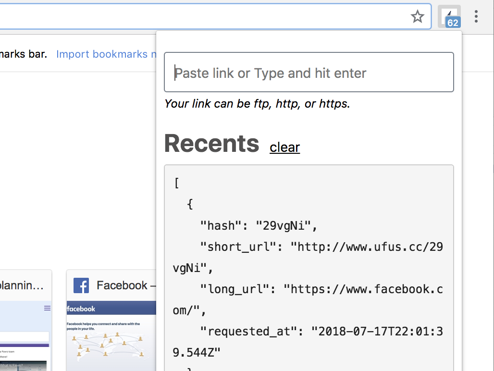
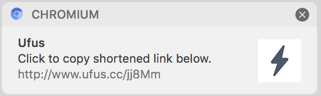

# Ufus extension

Ufus in your browser! Start shortening immediately.

## Install

- Chrome
- Firefox
- Opera

## Permissions

##### Storage

Ufus extenstion uses chrome storage sync to persist options page and browser localstorage for recents, granted permissions and notifications identifiers.

#### Clipboard

Ufus extension uses chrome clipboard to copy shortened URL.

## Optional Permissions

#### Notifications

Enable/Disable desktop notifications and notifications sound from Ufus (i.e. extension) options page. Ufus will request notifications permission, granting this permission will allow you recieve notification when URL's shorten successfully.

#### Tabs

Enable/Disable shortening current browser tab URL from Ufus (i.e. extension) options page. Ufus will request browser tabs permission, granting this permission will allow Ufus to capture and shorten URL immediately.

## Notifications

Opt-in to receive desktop notifications when URL's shortened successfully. Clicking on the notification copies the shortened URL.

## License

MIT © [Akinjide Bankole](htttps://www.akinjide.me)
